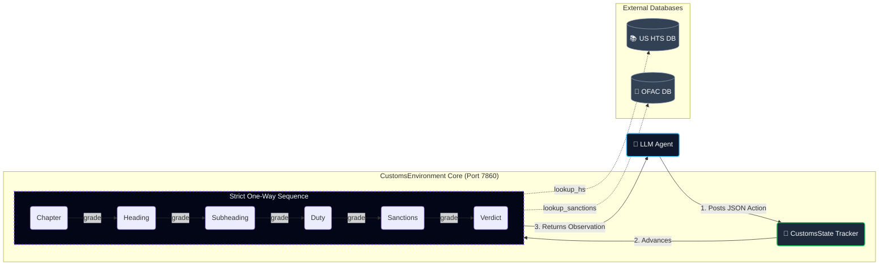

# 🛃 Customs Trade Classification — OpenEnv Environment

> **A real-world autonomous compliance pipeline for the Meta PyTorch OpenEnv Hackathon.**

This environment places an AI agent inside a live customs brokerage workflow. The agent must classify international shipments against the **US Harmonized Tariff Schedule (HTS)**, verify country-of-origin against an **OFAC sanctions database**, and submit legally binding `approve` or `hold` verdicts — all within a strict step budget.

It is specifically designed to evaluate the reasoning boundaries of **`meta-llama/Llama-3.3-70B-Instruct`** across three distinct cognitive challenges: tool navigation, geopolitical deduction, and hierarchical tabular disambiguation.

---

## ✨ Key Features

- 🔍 **Live HTS Lookup Tool** — The agent navigates 10,000+ rows of the real US tariff schedule via structured tool-calling. It is never handed a tariff code — it must earn it.
- 📊 **Partial-Credit Fuzzy Grading** — Powered by `rapidfuzz`, the subheading grader awards graduated credit for near-miss classifications, creating a dense, continuous RL training signal rather than a sparse binary reward.
- 🎯 **Strict Normalized Reward** — Total episode reward is normalized to `[0.0, 1.0]` across six independently graded compliance checkpoints.
- 🔒 **One-Way State Machine** — Enforces a forward-only classification workflow (Chapter → Heading → Subheading → Duty → Sanctions → Verdict). Prevents backtracking and reward hacking.
- ⚡ **Concurrent Session Support** — `SUPPORTS_CONCURRENT_SESSIONS = True`. Fully safe for parallel evaluation pipelines.

---

## 🎯 Reward Structure

| Component | Weight | Grader Type |
|-----------|:------:|-------------|
| Chapter Classification | **15%** | Exact string match |
| Heading Classification | **20%** | Exact match + partial credit |
| Subheading Classification | **25%** | `rapidfuzz` token ratio |
| Duty Rate | **20%** | Normalized float comparison |
| Sanctions Check | **10%** | Deterministic OFAC lookup |
| Final Verdict (`approve`/`hold`) | **10%** | Boolean |

---

## 🗂️ Task Breakdown

### 🟢 `task_easy` — Standard Shipment Classification
**Verified Score: 1.00** &nbsp;|&nbsp; Max Steps: 15

Clear household/industrial goods from non-sanctioned origins. The product description includes a `[SYSTEM HINT]` pointing to the correct HS Chapter and Heading.

**Tests:** Basic tool-use discipline and strict workflow adherence.

---

### 🟡 `task_medium` — Geopolitical Deductive Reasoning
**Verified Score: ~0.59** &nbsp;|&nbsp; Max Steps: 20

Dual-use industrial goods (centrifuges, heat exchangers, hydraulic presses) from **OFAC-sanctioned nations** (Iran, Russia, North Korea, Syria, Belarus). The origin is stated explicitly in the product text. The agent must connect the text signal to a sanctions lookup and issue a `hold` verdict.

**Tests:** Multi-step deductive reasoning and procedural compliance under geopolitical complexity.

---

### 🔴 `task_hard` — Hierarchical Tabular Threshold Disambiguation
**Verified Score: ~0.35** &nbsp;|&nbsp; Max Steps: 30

High-spec industrial equipment (lyophilizers, mass spectrometers, industrial microwave arrays) from **safe, non-sanctioned countries** (Japan, Canada, Australia). There are no sanctions points to earn — the agent must navigate to the correct 10-digit HTS subheading purely through **technical parameter thresholds** buried in tabular data (e.g., wattage output, condenser capacity, operating temperature range).

**Tests:** Continuous hierarchical tabular navigation. This is the true cognitive frontier for LLMs.

---

## 📊 Verified Baseline Score

> [!IMPORTANT]
> **Difficulty Calibrated to Machine Learning Cognitive Limits — Not Human Intuition**
>
> During baseline testing we discovered that frontier models excel at the geopolitical deductive reasoning in our Medium tier, while the true cognitive wall for LLMs is navigating hierarchical tabular data with tight numerical thresholds. Our difficulty curve is therefore calibrated to **where Llama 3.3 actually struggles**, not where a human expert would.

| Model | `task_easy` | `task_medium` | `task_hard` |
|-------|:-----------:|:-------------:|:-----------:|
| `meta-llama/Llama-3.3-70B-Instruct` | **1.00** | **0.59** | **0.35** |

> *Scores represent a strictly verified staircase: `1.00 → 0.59 → 0.35` — confirming a clean, monotonic difficulty gradient with no ceiling-flooring artifacts.*

---

## 🚀 Quick Start

### Prerequisites
- Python 3.11+
- `openenv-core` installed
- A valid `HF_TOKEN` from [huggingface.co/settings/tokens](https://huggingface.co/settings/tokens)

### Validate the Environment

```bash
openenv validate
# Expected output: [OK] customs: Ready for multi-mode deployment
```

### Run the Inference Baseline

```bash
export HF_TOKEN=your_token_here
export API_BASE_URL=https://router.huggingface.co/v1
export MODEL_NAME=meta-llama/Llama-3.3-70B-Instruct

# Start the environment server
uvicorn server.app:app --host 127.0.0.1 --port 7860 &

# Run all three tasks
python inference.py
```

### Run with Docker

```bash
docker build -t customs-trade-classification .
docker run -p 7860:7860 customs-trade-classification
```

---

## 🏗️ Project Structure

```
customs-trade-classification/
│
├── openenv.yaml              # Environment manifest — tasks, difficulty, reward thresholds
├── Dockerfile                # Multi-stage build, openenv-base image, port 7860
├── pyproject.toml            # Package metadata
├── requirements.txt          # Pinned dependencies
│
├── inference.py              # Official evaluation runner — [START]/[STEP]/[END] log format
├── test_local.py             # Local test harness
├── client.py                 # OpenEnv API client with full Pydantic model parsing
├── models.py                 # CustomsState and CustomsAction Pydantic models
│
├── server/
│   ├── app.py                # FastAPI entry point + explicit /health endpoint
│   └── environment.py        # Core RL logic — state machine, graders, shipment catalogue
│
├── data/
│   ├── hts_data.json         # US Harmonized Tariff Schedule subset (~5,000 entries)
│   ├── ofac_sdn.csv          # OFAC sanctions country list
│   └── loader.py             # Data parsing and HTS index construction
│
└── tests/
    └── test_graders.py       # pytest suite validating fuzzy scoring and grader math
```

---

## 🔬 Environment Architecture


---

## 📋 Action Space Reference

| Action | Value Format | Trigger Condition |
|--------|-------------|-------------------|
| `lookup_hs` | HTS prefix — e.g. `"84"`, `"8419"` | Always available |
| `classify_chapter` | 2-digit — e.g. `"84"` | Before chapter locked |
| `classify_heading` | 4-digit — e.g. `"8419"` | After chapter locked |
| `classify_subheading` | 10-digit — e.g. `"8419.39.02.00"` | After heading locked |
| `check_duty` | Rate string — e.g. `"Free"`, `"3.5%"` | After subheading locked |
| `lookup_sanctions` | Country name — e.g. `"Iran"` | After duty locked |
| `check_sanctions` | `"flagged"` or `"clear"` | After sanctions lookup |
| `submit` | `"approve"` or `"hold"` | Final step only |

---

*Built for the **Meta PyTorch OpenEnv Hackathon 2026**. Calibrated against `meta-llama/Llama-3.3-70B-Instruct`.*
